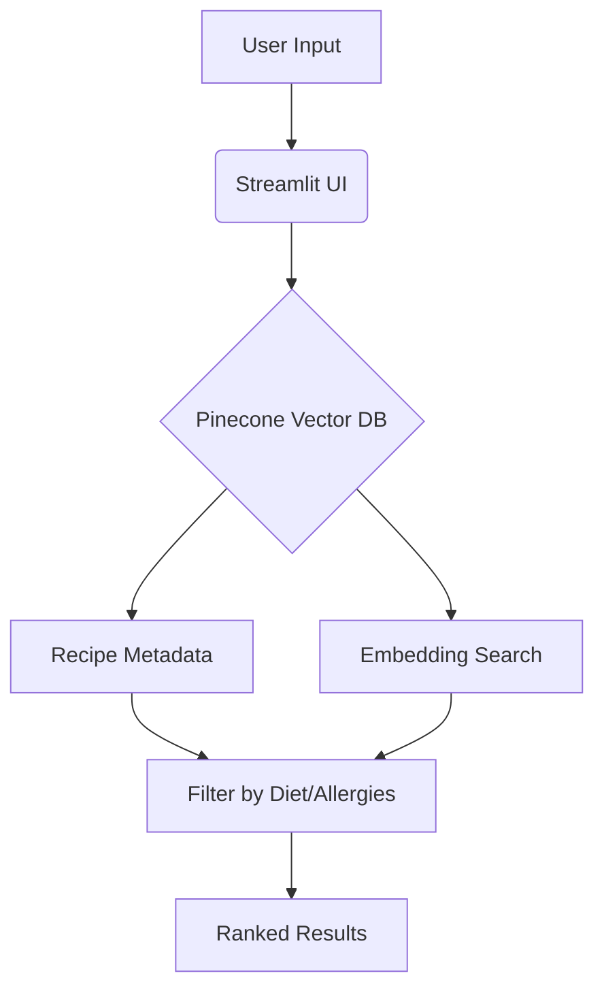

# 🍲 AI-Powered Recipe & Nutrition Recommender

A smart recipe recommendation system that combines dietary preferences, health conditions, and AI-powered search to suggest personalized recipes.

## ✨ Key Features

- **Dietary Intelligence**: Filters recipes by vegan, gluten-free, etc.
- **Allergy Protection**: Detects allergens (nuts, dairy) and suggests substitutions
- **Health-Conscious**: Recommends recipes based on diabetes/heart-health needs
- **Cultural Adaptation**: Optimizes for Italian, Mexican, Asian cuisines
- **Nutrition Scoring**: Ranks recipes by protein/carb/fat balance

## 🛠️ Tech Stack

| Component               | Technology                          |
|-------------------------|-------------------------------------|
| **Vector Database**     | Pinecone                            |
| **Embeddings**          | Sentence Transformers (`all-MiniLM-L6-v2`) |
| **UI Framework**        | Streamlit                           |
| **Backend**            | Python 3.9+                         |

## 🚀 Quick Start

### Prerequisites
- Python 3.9+
- Pinecone API key (free tier available)
- GitHub account

### Installation

1. **Clone the repository**
   ```bash
   git clone https://github.com/Animesh2k3/recipe-recommender-system.git
   cd recipe-recommender-system
   ```

2. **Set up virtual environment**
   ```bash
   python -m venv venv
   source venv/bin/activate  # Linux/Mac
   venv\Scripts\activate     # Windows
   ```

3. **Install dependencies**
   ```bash
   pip install -r requirements.txt
   ```

4. **Configure environment**
   Create `.env` file:
   ```ini
   PINECONE_API_KEY=your_api_key_here
   INDEX_NAME=recipe-index
   ```

### Usage

1. **Load recipe data**
   ```bash
   python ingest_data.py
   ```

2. **Launch the app**
   ```bash
   streamlit run app.py
   ```

## 📊 System Architecture



## 📚 Customization Guide

### Add New Recipes
1. Edit `recipes.csv` following this format:
   ```csv
   name,ingredients,instructions,...,tags
   "Vegan Curry","tofu, coconut milk,...","Sauté...",...,"vegan, gluten-free"
   ```

### Modify Dietary Rules
Edit `utils.py` to:
- Add new allergies in `SUBSTITUTIONS`
- Update health conditions in `HEALTH_CONDITION_RECOMMENDATIONS`

## 🌐 Deployment Options

### Option A: Streamlit Cloud (Free)
1. Create `secrets.toml`:
   ```toml
   PINECONE_API_KEY = "your_key"
   INDEX_NAME = "recipe-index"
   ```
2. Deploy via [Streamlit Community Cloud](https://share.streamlit.io/)

## 🤝 Contributing
1. Fork the repository
2. Create your feature branch (`git checkout -b feature/AmazingFeature`)
3. Commit changes (`git commit -m 'Add some feature'`)
4. Push to branch (`git push origin feature/AmazingFeature`)
5. Open a Pull Request

